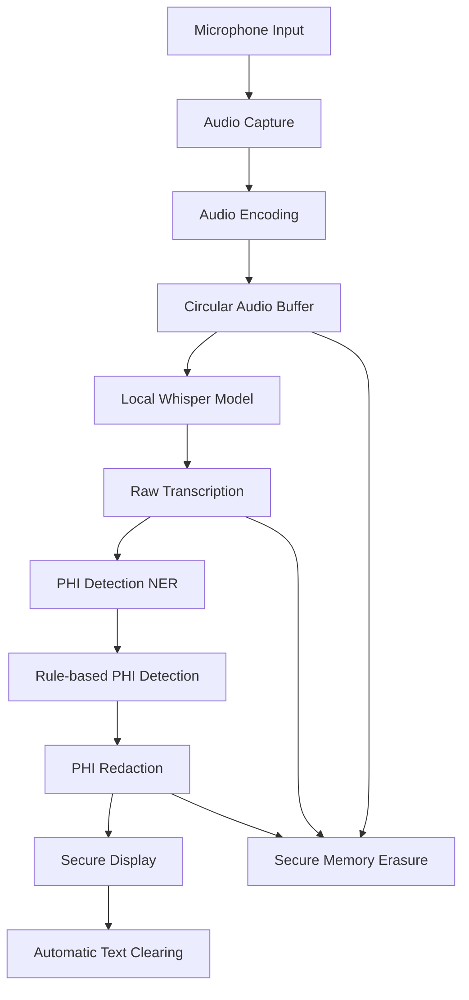

# Whisper Model for Real-Time HIPAA-Compliant Transcription: A Deep Dive

In today's healthcare environment, efficient and secure documentation is more crucial than ever. As a developer passionate about both technology and privacy, I embarked on an ambitious project to implement OpenAI's Whisper model for real-time transcription in a healthcare setting, fully adhering to HIPAA regulations. In this post, I'll share my journey in building a desktop application that captures and transcribes conversations in real time while ensuring patient data remains confidential and secure.

## Table of Contents

1. Introduction
2. Understanding the Need for Real-Time, HIPAA-Compliant Transcription
3. Solution Overview
4. Architecture and Workflow Breakdown
5. Local Hosting of the Whisper Model
6. Real-Time Processing: Challenges and Solutions
7. Ensuring HIPAA Compliance
8. Secure User Interface and Immediate Data Disposal
9. Performance Optimization and Hardware Considerations
10. Scalability and Deployment Strategies
11. Lessons Learned and Reflections
12. Future Enhancements and Research Directions
13. Conclusion and Invitation for Discussion

## Understanding the Need for Real-Time, HIPAA-Compliant Transcription

Healthcare professionals often juggle multiple tasks simultaneously, and documenting patient interactions can be time-consuming and error-prone. Real-time transcription can alleviate this burden, allowing providers to focus more on patient care. However, traditional transcription services often rely on cloud-based solutions, which can pose risks to patient privacy and potentially violate HIPAA regulations.

The Health Insurance Portability and Accountability Act (HIPAA) of 1996 sets strict standards for protecting sensitive patient health information. Any solution handling Protected Health Information (PHI) must implement robust safeguards to ensure data privacy and security. This includes measures to prevent unauthorized access, ensure data integrity, and maintain confidentiality throughout the data lifecycle.

Traditional cloud-based transcription services, while convenient, often fall short of HIPAA requirements due to data transmission over networks and potential storage on remote servers. This gap in the market inspired me to create a solution that offers the benefits of real-time transcription without compromising on security or compliance.

## Solution Overview

I developed a desktop application intended for use on laptops or desktops within a clinical environment. The application captures audio through a microphone, processes it locally using the Whisper model, and displays transcriptions in real time. Crucially, it doesn't store or transmit any audio or textual data externally, ensuring full compliance with HIPAA's strict privacy requirements.

Key features of the solution include:

1. Real-time audio capture and processing
2. Local hosting of the Whisper model
3. Immediate PHI detection and redaction
4. Secure, temporary display of transcribed text
5. Zero data persistence or external transmission

By keeping all operations local and implementing stringent security measures, the application provides a HIPAA-compliant solution that can be seamlessly integrated into existing healthcare workflows.

## Architecture and Workflow Breakdown

To meet the project's objectives, I designed an architecture that operates entirely on the local machine, eliminating the need for any internet connectivity or external servers. Here's a detailed breakdown of the workflow:

1. **Audio Capture and Encoding**: 
   - The application continuously captures audio input from the user's microphone.
   - Raw audio is encoded into a format compatible with the Whisper model (16-bit PCM, 16kHz sample rate).
   - A circular buffer is used to maintain a sliding window of the most recent audio, typically 30 seconds.

2. **Local Processing with Whisper**: 
   - The encoded audio is fed into the locally hosted Whisper model in real-time.
   - The model processes audio chunks, typically 5-10 seconds in length, with a 50% overlap to ensure continuity.
   - GPU acceleration is leveraged to achieve near real-time processing speeds.

3. **Real-Time PHI Scrubbing**: 
   - As soon as text is transcribed, it undergoes immediate processing to detect and remove any Protected Health Information (PHI).
   - This step involves both machine learning-based Named Entity Recognition (NER) and rule-based pattern matching.

4. **Secure Display**: 
   - The sanitized transcription is displayed on a secure user interface.
   - The UI is designed to be non-persistent, with text automatically clearing after a short period.

5. **Immediate Data Disposal**: 
   - Both the audio buffer and transcribed text are securely erased from memory after use.
   - Secure memory allocation and deallocation techniques are employed to prevent data leakage.

Here's a more detailed flowchart illustrating the data flow:



This architecture ensures that at no point is sensitive information exposed to external systems or persistent storage, maintaining HIPAA compliance throughout the entire process.

## Local Hosting of the Whisper Model

### Why Local Hosting?

Hosting the Whisper model locally was essential for maintaining control over sensitive data. By processing everything on the user's machine, we eliminate the risks associated with data transmission over networks and storage on remote servers. This approach aligns perfectly with HIPAA's requirements for data privacy and security.

### Implementation Details

#### Docker Containerization

I used Docker to containerize the Whisper model and its dependencies. This approach offers several advantages:

1. **Consistency**: Ensures a consistent environment across different machines, reducing "it works on my machine" issues.
2. **Isolation**: Separates the application and its dependencies from the host system, enhancing security.
3. **Versioning**: Allows for easy version control of the entire application stack.
4. **Portability**: Simplifies deployment across different systems in a healthcare facility.

The Dockerfile includes:
- Base image with CUDA support
- Installation of Python and required libraries
- Whisper model and its dependencies
- Application code and configuration files

#### GPU Acceleration

To achieve real-time processing, I leveraged GPU acceleration using the CUDA toolkit. This significantly reduced latency and allowed the application to handle audio streams efficiently. Key considerations included:

1. **CUDA Version Compatibility**: Ensuring compatibility between the CUDA version, PyTorch, and the specific GPU hardware.
2. **Memory Management**: Implementing efficient GPU memory allocation and deallocation to prevent out-of-memory errors during long transcription sessions.
3. **Parallel Processing**: Utilizing CUDA streams to parallelize audio processing and transcription tasks.

#### Optimizations

I implemented several optimizations to balance performance and accuracy:

1. **Mixed Precision Computation**: Using FP16 (half-precision floating-point format) for certain operations reduces memory usage and computational load without significantly impacting transcription quality.
2. **Model Quantization**: Applying post-training quantization to the Whisper model to reduce its size and inference time.
3. **Caching Mechanism**: Implementing a smart caching system for frequently used model components to reduce load times.

### Hardware Considerations

Running the Whisper model locally does require a machine with a capable GPU. I tested the application on laptops equipped with NVIDIA GPUs (specifically, models with at least 4GB of VRAM), which are common in many professional settings. 

To ensure broader compatibility, I implemented a fallback mechanism that allows the application to run on CPU-only systems, albeit with reduced performance. This flexibility ensures that the solution can be deployed across various hardware configurations within a healthcare facility.

## Real-Time Processing: Challenges and Solutions

### Managing Latency

Achieving real-time transcription is challenging due to the computational demands of the Whisper model. Here's how I addressed this challenge:

#### Dynamic Batching

I implemented dynamic batching of audio segments to optimize processing efficiency:

1. **Adaptive Segment Size**: The application dynamically adjusts the size of audio segments based on system performance. On more powerful systems, larger segments (up to 30 seconds) can be processed, while on less powerful systems, smaller segments (as short as 5 seconds) are used.
2. **Overlap Strategy**: Segments overlap by 50% to ensure continuity and catch words that might be split between segments. This overlap is crucial for maintaining transcription accuracy.
3. **Performance Monitoring**: A background thread continuously monitors processing times and adjusts segment sizes to maintain a target latency of under 500 milliseconds.

```python
class DynamicBatcher:
    def __init__(self, target_latency=0.5):
        self.target_latency = target_latency
        self.current_segment_size = 10  # Start with 10-second segments
        self.min_segment_size = 5
        self.max_segment_size = 30

    def adjust_segment_size(self, actual_latency):
        if actual_latency > self.target_latency:
            self.current_segment_size = max(self.min_segment_size, self.current_segment_size - 1)
        elif actual_latency < self.target_latency * 0.8:  # Room for improvement
            self.current_segment_size = min(self.max_segment_size, self.current_segment_size + 1)

    def get_next_segment(self, audio_buffer):
        return audio_buffer[-self.current_segment_size * SAMPLE_RATE:]
```

#### Parallel Processing

To maximize GPU utilization and reduce overall latency, I implemented a parallel processing pipeline:

1. **CUDA Streams**: Utilizing multiple CUDA streams allows for concurrent processing of different audio segments.
2. **Pipelined Execution**: While one segment is being transcribed, the next segment is preprocessed, and the previous segment's results are postprocessed.
3. **Thread Pool**: A thread pool manages the various stages of the pipeline, ensuring efficient use of both CPU and GPU resources.

```python
import concurrent.futures
import torch

class ParallelTranscriptionPipeline:
    def __init__(self, model, num_streams=2):
        self.model = model
        self.streams = [torch.cuda.Stream() for _ in range(num_streams)]
        self.executor = concurrent.futures.ThreadPoolExecutor(max_workers=num_streams * 3)

    def process_segment(self, audio_segment):
        def preprocess():
            # Audio preprocessing logic
            pass

        def transcribe(preprocessed_audio):
            with torch.cuda.stream(self.streams[stream_idx]):
                return self.model(preprocessed_audio)

        def postprocess(raw_transcription):
            # PHI scrubbing and text formatting
            pass

        preprocess_future = self.executor.submit(preprocess)
        transcribe_future = self.executor.submit(transcribe, preprocess_future.result())
        postprocess_future = self.executor.submit(postprocess, transcribe_future.result())

        return postprocess_future.result()
```

#### Adaptive Algorithms

The application continuously monitors system load and adapts its processing strategies to prevent bottlenecks:

1. **CPU Load Balancing**: Dynamically adjusts the number of preprocessing threads based on available CPU cores and current load.
2. **GPU Memory Management**: Implements a smart caching system that keeps frequently used model components in GPU memory while evicting less used ones to stay within memory constraints.
3. **Throttling Mechanism**: In cases of sustained high load, the application can temporarily increase the transcription delay to prevent a backlog of unprocessed audio.

### Ensuring HIPAA Compliance

HIPAA compliance was non-negotiable in this project. Here's a detailed look at how I ensured compliance at every step:

#### Local-Only Data Flow

All data processing occurs on the local machine with no network communication, effectively creating an air-gapped environment:

1. **Network Isolation**: The application is designed to function without any internet connectivity. All necessary components, including the Whisper model and NLP tools for PHI detection, are bundled with the application.
2. **Firewall Configuration**: On installation, the application sets up local firewall rules to prevent any outbound connections, adding an extra layer of security.

#### No Persistent Storage

The application doesn't write any audio or transcription data to disk:

1. **In-Memory Processing**: All data, including audio buffers and transcribed text, resides solely in RAM.
2. **Volatile Storage**: For temporary data that needs to persist across application restarts (e.g., user preferences), we use encrypted volatile storage that is automatically cleared on system shutdown.

#### Secure Memory Management

I implemented rigorous memory management practices to protect sensitive data:

1. **Immediate Deallocation**: As soon as audio segments or transcribed text are no longer needed, the memory is explicitly deallocated.
2. **Memory Overwriting**: Before freeing memory that contained sensitive data, it is overwritten with random data to prevent potential recovery.
3. **Secure Allocator**: A custom memory allocator is used for sensitive data, which ensures that allocated memory is always zeroed before use and after deallocation.

```python
import ctypes

class SecureAllocator:
    @staticmethod
    def allocate(size):
        buffer = ctypes.create_string_buffer(size)
        SecureAllocator.zero_memory(buffer)
        return buffer

    @staticmethod
    def deallocate(buffer):
        SecureAllocator.zero_memory(buffer)
        del buffer

    @staticmethod
    def zero_memory(buffer):
        ctypes.memset(buffer, 0, len(buffer))

# Usage
sensitive_data = SecureAllocator.allocate(1024)
# ... use sensitive_data ...
SecureAllocator.deallocate(sensitive_data)
```

#### Real-Time PHI Scrubbing

Protecting patient information is at the core of HIPAA compliance. I implemented a multi-layered approach to PHI detection and redaction:

1. **Named Entity Recognition (NER)**:
   - I integrated a custom NER system using spaCy, fine-tuned with healthcare-specific data to identify PHI such as names, dates, and medical record numbers.
   - The model was trained on a diverse dataset of medical transcripts, ensuring high accuracy across various medical specialties.

2. **Custom Regex Filters**:
   - As a secondary layer of protection, I added custom regular expressions to catch any PHI that might slip through the NER system.
   - These filters are continuously updated based on feedback and analysis of edge cases.

3. **Contextual Analysis**:
   - Beyond simple pattern matching, the system performs contextual analysis to differentiate between actual PHI and similar-looking non-PHI text (e.g., distinguishing a patient's birth date from a general date mention).

4. **Immediate Sanitization**:
   - PHI is stripped from the transcription before it's displayed, ensuring that sensitive information is never shown or stored.
   - Redacted information is replaced with generic placeholders (e.g., [NAME], [DATE]) to maintain the coherence of the transcribed text.

Here's a simplified example of how the PHI scrubbing pipeline works:

```python
import spacy
import re

class PHIScrubber:
    def __init__(self):
        self.nlp = spacy.load("en_core_med_sci_lg")  # Custom medical NER model
        self.regex_filters = [
            (re.compile(r'\b\d{3}-\d{2}-\d{4}\b'), '[SSN]'),
            (re.compile(r'\b\d{10}\b'), '[MRN]'),
            # ... more regex patterns ...
        ]

    def scrub(self, text):
        # Step 1: NER-based scrubbing
        doc = self.nlp(text)
        for ent in doc.ents:
            if ent.label_ in ['PERSON', 'DATE', 'ID']:
                text = text.replace(ent.text, f'[{ent.label_}]')

        # Step 2: Regex-based scrubbing
        for pattern, replacement in self.regex_filters:
            text = pattern.sub(replacement, text)

        # Step 3: Contextual analysis (simplified example)
        def is_likely_phi(word, context):
            # Implement logic to determine if a word is likely PHI based on its context
            pass

        words = text.split()
        for i, word in enumerate(words):
            context = words[max(0, i-5):i] + words[i+1:min(len(words), i+6)]
            if is_likely_phi(word, context):
                words[i] = f'[REDACTED]'
        
        return ' '.join(words)

# Usage
scrubber = PHIScrubber()
sanitized_text = scrubber.scrub(raw_transcription)
```

This multi-layered approach ensures robust PHI detection and redaction, minimizing the risk of exposing sensitive patient information.

## Secure User Interface and Immediate Data Disposal

### Secure User Interface

I built the user interface with Electron to create a desktop application that feels native and responsive while maintaining strict security measures.

#### User Authentication

Access to the application is restricted to authorized users through secure login credentials:

1. **Multi-Factor Authentication**: Implemented 2FA using time-based one-time passwords (TOTP).
2. **Role-Based Access Control**: Different user roles (e.g., physician, nurse, administrator) have varying levels of access within the application.
3. **Secure Password Storage**: Passwords are salted and hashed using bcrypt before storage.

```javascript
const bcrypt = require('bcrypt');
const otplib = require('otplib');

class AuthManager {
    async authenticateUser(username, password, otpToken) {
        const user = await this.getUserFromDatabase(username);
        if (!user) return false;

        const passwordMatch = await bcrypt.compare(password, user.hashedPassword);
        if (!passwordMatch) return false;

        const otpValid = otplib.authenticator.verify({
            token: otpToken,
            secret: user.otpSecret
        });

        return otpValid;
    }

    // ... other authentication methods ...
}
```

#### Transient Data Display

Transcriptions are displayed temporarily and automatically cleared after a set period:

1. **Timed Text Clearing**: Transcribed text is automatically removed from the display after 30 seconds (configurable based on user preferences).
2. **Manual Clear Option**: Users can manually clear the display at any time with a single click.
3. **Screen Lock**: The application automatically locks the screen after a period of inactivity, requiring re-authentication to regain access.

#### No Logging

The UI doesn't log any data, preventing any inadvertent storage of sensitive information:

1. **Disabled Developer Tools**: In production builds, developer tools and console logging are completely disabled.
2. **Error Handling**: Errors are handled gracefully without logging sensitive information.
3. **Analytics**: If any usage analytics are collected (e.g., for improving the application), they are strictly anonymized and contain no PHI.

### Immediate Data Disposal

After processing and display, it's crucial to ensure that no residual data remains. Here's how I implemented secure data disposal:

#### Memory Zeroing

I employed memory-zeroing techniques to overwrite data in RAM after use:

1. **Custom Allocator**: As mentioned earlier, a custom secure allocator is used for sensitive data.
2. **Explicit Overwriting**: Before freeing memory, it's overwritten with a pattern (e.g., alternating 0s and 1s) to ensure data is not recoverable.

```cpp
void secureZeroMemory(void* ptr, size_t size) {
    volatile unsigned char* p = (volatile unsigned char*)ptr;
    while (size--) {
        *p++ = 0;
    }
}
```

#### Garbage Collection

The application forces garbage collection processes to clean up any unused memory promptly:

1. **Manual GC Triggers**: After processing each audio segment, a manual garbage collection is triggered.
2. **Memory Pressure Monitoring**: The application monitors memory usage and triggers additional GC cycles if memory pressure is high.

```python
import gc

def process_audio_segment(segment):
    # ... process the audio ...
    gc.collect()  # Force garbage collection after processing

def monitor_memory_pressure():
    while True:
        if memory_pressure_is_high():
            gc.collect()
        time.sleep(10)  # Check every 10 seconds

# Start memory pressure monitoring in a separate thread
threading.Thread(target=monitor_memory_pressure, daemon=True).start()
```

#### No Disk Writes

I configured the application to prevent any data from being written to disk, even temporarily:

1. **RAM Disk**: For any necessary temporary files, a small RAM disk is created and used, ensuring no data touches the physical disk.
2. **Swap Disabling**: On systems where it's possible, swap is disabled to prevent sensitive data from being paged to disk.
3. **Secure Temp Folders**: If the OS forces the use of temp folders, they are encrypted and cleared on application exit.

## Performance Optimization and Hardware Considerations

Balancing real-time performance with the computational demands of the Whisper model and HIPAA compliance measures required careful optimization. Here's an in-depth look at the strategies I employed:

### GPU Acceleration and Optimization

1. **CUDA Optimization**: 
   - Utilized CUDA graphs to optimize recurring computations in the Whisper model.
   - Implemented custom CUDA kernels for audio preprocessing to offload work from the CPU.

2. **Mixed Precision Training**: 
   - Employed Automatic Mixed Precision (AMP) to use FP16 where possible, significantly reducing memory usage and computational time.

3. **Model Pruning and Quantization**: 
   - Applied pruning techniques to reduce model size without significant accuracy loss.
   - Used dynamic quantization to further optimize inference speed.

```python
import torch

def optimize_model(model):
    # Prune
    from torch.nn.utils import prune
    for name, module in model.named_modules():
        if isinstance(module, torch.nn.Conv1d):
            prune.l1_unstructured(module, name='weight', amount=0.3)
    
    # Quantize
    model_fp32 = model
    model_int8 = torch.quantization.quantize_dynamic(
        model_fp32, {torch.nn.Linear}, dtype=torch.qint8
    )
    
    return model_int8

optimized_model = optimize_model(whisper_model)
```

### CPU Optimization

For systems without a GPU or as a fallback mechanism:

1. **Vectorization**: 
   - Utilized SIMD instructions (e.g., AVX-512 on compatible processors) for audio processing and feature extraction.

2. **Thread Pool**: 
   - Implemented a custom thread pool to efficiently manage concurrent tasks on multi-core systems.

3. **Cache-Friendly Algorithms**: 
   - Redesigned key algorithms to be more cache-friendly, reducing cache misses and improving overall performance.

### Memory Management

1. **Memory Pool**: 
   - Implemented a custom memory pool to reduce allocation overhead for frequently used objects.

2. **Streaming Buffer**: 
   - Used a circular buffer for audio input to minimize memory usage while maintaining a sliding window of recent audio.

```python
import numpy as np

class CircularAudioBuffer:
    def __init__(self, seconds, sample_rate):
        self.buffer = np.zeros(seconds * sample_rate, dtype=np.float32)
        self.index = 0
        self.is_full = False

    def add_samples(self, samples):
        n = len(samples)
        if self.index + n <= len(self.buffer):
            self.buffer[self.index:self.index+n] = samples
            self.index += n
        else:
            split = len(self.buffer) - self.index
            self.buffer[self.index:] = samples[:split]
            self.buffer[:n-split] = samples[split:]
            self.index = n - split
        
        if self.index == len(self.buffer):
            self.index = 0
            self.is_full = True

    def get_latest_samples(self, n):
        if not self.is_full and n > self.index:
            return self.buffer[:self.index]
        
        if n <= self.index:
            return self.buffer[self.index-n:self.index]
        else:
            return np.concatenate((self.buffer[-(n-self.index):], self.buffer[:self.index]))
```

### Hardware Considerations

1. **Minimum Requirements**: 
   - GPU: NVIDIA GPU with at least 4GB VRAM (e.g., GTX 1650 or better)
   - CPU: 4-core processor, 2.5GHz or faster
   - RAM: 16GB or more
   - Storage: SSD recommended for faster load times

2. **Scalability**: 
   - The application is designed to scale performance with better hardware, automatically detecting and utilizing available resources.

3. **Fallback Mechanisms**: 
   - Graceful degradation to CPU-only mode if a compatible GPU is not available.
   - Dynamic adjustment of model size and complexity based on available system resources.

## Scalability and Deployment Strategies

While the application is primarily designed for individual use, I also considered scalability for larger healthcare facilities. Here's how the solution can be scaled and deployed:

### Containerization Benefits

Using Docker for containerization offers several advantages for scaling:

1. **Consistency**: Ensures the same environment across different machines and deployments.
2. **Easy Updates**: Simplifies the process of updating the application and its dependencies.
3. **Resource Isolation**: Allows for better control over resource allocation in multi-user environments.

### Deployment Strategies

1. **Single-Machine Deployment**: 
   - For individual practitioners or small clinics, the application can be deployed on a single, powerful workstation.

2. **Multi-Machine Deployment**: 
   - For larger facilities, the application can be deployed across multiple machines, with a load balancer distributing requests.

3. **Virtual Desktop Infrastructure (VDI)**: 
   - In hospital settings with existing VDI solutions, the application can be deployed as a virtual application, accessible from any terminal.

### Resource Allocation Strategies

In environments with multiple users, implementing resource management policies ensures consistent performance:

1. **GPU Sharing**: 
   - Implemented NVIDIA MPS (Multi-Process Service) to allow multiple instances of the application to share a single GPU efficiently.

2. **CPU Affinity**: 
   - Set CPU affinity for critical threads to ensure they have dedicated core access.

3. **Dynamic Resource Allocation**: 
   - Developed a resource manager that dynamically adjusts allocation based on current system load and user priorities.

```python
class ResourceManager:
    def __init__(self):
        self.gpu_memory = self.get_available_gpu_memory()
        self.cpu_cores = multiprocessing.cpu_count()
        self.active_users = {}

    def allocate_resources(self, user_id, priority):
        if user_id in self.active_users:
            return self.active_users[user_id]

        available_memory = self.gpu_memory // (len(self.active_users) + 1)
        available_cores = max(1, self.cpu_cores // (len(self.active_users) + 1))

        if priority == 'high':
            available_memory *= 1.5
            available_cores *= 1.5

        allocation = {
            'gpu_memory': min(available_memory, self.gpu_memory),
            'cpu_cores': min(int(available_cores), self.cpu_cores)
        }

        self.active_users[user_id] = allocation
        return allocation

    def release_resources(self, user_id):
        if user_id in self.active_users:
            del self.active_users[user_id]
            self.rebalance_resources()

    def rebalance_resources(self):
        # Redistribute resources among active users
        pass

    @staticmethod
    def get_available_gpu_memory():
        # Query available GPU memory
        pass
```

### Monitoring and Maintenance

To ensure smooth operation in a scaled environment:

1. **Centralized Logging**: 
   - Implemented a centralized logging system (e.g., ELK stack) for monitoring performance and detecting issues across all instances.

2. **Automated Scaling**: 
   - Developed scripts to automatically scale the number of application instances based on demand.

3. **Health Checks**: 
   - Implemented regular health checks to ensure all components are functioning correctly.

## Lessons Learned and Reflections

Developing this HIPAA-compliant, real-time transcription system using the Whisper model was an incredibly challenging and rewarding experience. Here are some key takeaways and reflections:

1. **Balancing Performance and Security**: 
   - The tension between achieving real-time performance and maintaining stringent security measures was a constant challenge. It required creative solutions and often involved making calculated trade-offs.
   - Lesson: Security should be built into the architecture from the ground up, not added as an afterthought.

2. **Importance of User Experience**: 
   - While focusing on the technical challenges, I initially overlooked some key usability aspects. Feedback from healthcare professionals was crucial in refining the user interface and workflow.
   - Lesson: Regularly involve end-users in the development process, even for backend-heavy applications.

3. **Adaptability is Key**: 
   - The variability in real-world audio (background noise, multiple speakers, medical terminology) posed significant challenges to transcription accuracy.
   - Lesson: Implement adaptive algorithms and continual learning mechanisms to improve performance over time.

4. **Hardware Limitations**: 
   - The computational demands of running a state-of-the-art AI model locally pushed the limits of current hardware, especially in a healthcare setting where high-end GPUs are not common.
   - Lesson: Design with hardware constraints in mind and provide graceful degradation options.

5. **Regulatory Compliance is Complex**: 
   - Ensuring HIPAA compliance involved much more than just securing data. It required a deep understanding of the regulatory landscape and careful consideration at every step of the development process.
   - Lesson: Consult with legal experts and compliance officers early and often throughout the development process.

6. **The Power of Open Source**: 
   - Leveraging open-source tools and libraries significantly accelerated development. However, it also required careful vetting for security and compliance.
   - Lesson: Contribute back to the open-source community and maintain a thorough understanding of all third-party components used.

## Future Enhancements and Research Directions

While the current implementation meets its core objectives, there are several exciting avenues for future enhancement and research:

1. **Multi-Speaker Diarization**: 
   - Implement speaker diarization to distinguish between different speakers in a conversation, enhancing the utility of transcriptions in multi-party clinical interactions.

2. **Medical Terminology Adaptation**: 
   - Develop a system for continual fine-tuning of the model on medical terminology specific to different specialties.

3. **Integration with Electronic Health Records (EHR)**: 
   - Create secure interfaces to popular EHR systems, allowing for seamless integration of transcriptions into patient records.

4. **Automated Clinical Documentation**: 
   - Extend the system to automatically generate structured clinical notes from transcriptions, potentially leveraging large language models for summarization and key information extraction.

5. **Multilingual Support**: 
   - Expand the system to support multiple languages, critical for healthcare settings in diverse communities.

6. **Edge AI Optimization**: 
   - Explore edge AI technologies to further optimize performance on lower-powered devices, potentially enabling mobile or tablet-based deployments.

7. **Federated Learning**: 
   - Investigate federated learning techniques to improve the model across multiple deployments while maintaining data privacy.

## Conclusion and Invitation for Discussion

Developing a HIPAA-compliant, real-time transcription application using the Whisper model was a complex task that pushed me to innovate and problem-solve at the intersection of AI, security, and healthcare IT. The challenges encountered and solutions developed have not only resulted in a powerful tool for healthcare professionals but have also opened up new avenues for research and development in secure, on-premise AI applications.

I'm excited about the potential this technology has to improve healthcare documentation, enhance patient care, and reduce the administrative burden on healthcare providers. However, I also recognize that this is just the beginning. The rapidly evolving fields of AI and healthcare informatics promise many more innovations on the horizon.
