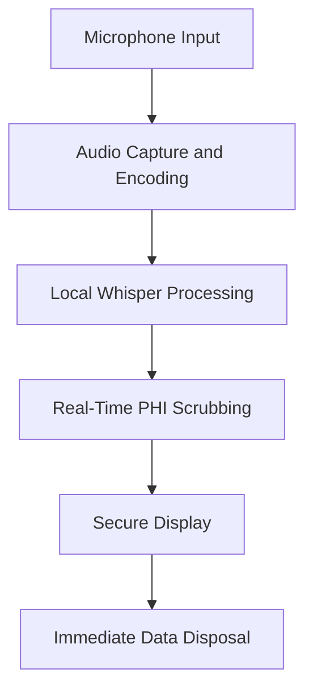

### Whisper Model for Real-Time HIPAA-Compliant Transcription: A Deep Dive

In today's healthcare environment, efficient and secure documentation is more important than ever. As a developer passionate about both technology and privacy, I embarked on a project to implement OpenAI's Whisper model for real-time transcription in a healthcare setting, fully adhering to HIPAA regulations. In this post, I'll share my journey in building a desktop application that captures and transcribes conversations in real time while ensuring patient data remains confidential and secure.

### Table of Contents

1. Introduction
2. Understanding the Need for Real-Time, HIPAA-Compliant Transcription
3. Solution Overview
4. Architecture and Workflow Breakdown
5. Local Hosting of the Whisper Model
6. Real-Time Processing: Challenges and Solutions
   - Managing Latency
   - Ensuring HIPAA Compliance
   - Real-Time PHI Scrubbing
7. Secure User Interface and Immediate Data Disposal
8. Addressing Challenges and Limitations
   - Hardware Constraints
   - Scalability Considerations
9. Lessons Learned and Reflections
10. Conclusion and Invitation for Discussion

#### Understanding the Need for Real-Time, HIPAA-Compliant Transcription

Healthcare professionals often juggle multiple tasks simultaneously, and documenting patient interactions can be time-consuming. Real-time transcription can alleviate this burden, allowing providers to focus more on patient care. However, traditional transcription services often rely on cloud-based solutions, which can pose risks to patient privacy and violate HIPAA regulations. I wanted to create a solution that offers the benefits of real-time transcription without compromising on security or compliance.

#### Solution Overview

I developed a **desktop application** intended for use on laptops or desktops within a clinical environment. The application captures audio through a microphone, processes it locally using the Whisper model, and displays transcriptions in real time. Crucially, it doesn't store or transmit any audio or textual data externally, ensuring full compliance with HIPAA's strict privacy requirements.

#### Architecture and Workflow Breakdown

To meet the project's objectives, I designed an architecture that operates entirely on the local machine, eliminating the need for any internet connectivity or external servers. Here's a high-level overview of the workflow:

1. **Audio Capture and Encoding**: The application captures audio input from the user's microphone.
2. **Local Processing with Whisper**: The captured audio is processed in real time using the Whisper model hosted locally.
3. **Real-Time PHI Scrubbing**: The transcribed text undergoes immediate processing to remove any Protected Health Information (PHI).
4. **Secure Display**: The sanitized transcription is displayed on a secure user interface.
5. **Immediate Data Disposal**: Both the audio and textual data are immediately purged after use.

Below is a flowchart illustrating the data flow:

#### Local Hosting of the Whisper Model

**Why Local Hosting?**

Hosting the Whisper model locally was essential for maintaining control over sensitive data. By processing everything on the user's machine, we eliminate the risks associated with data transmission over networks.

**Implementation Details**

- **Docker Containerization**: I used Docker to containerize the Whisper model. This approach ensures a consistent environment across different machines and isolates the application from the host system.
- **GPU Acceleration**: To achieve real-time processing, I leveraged GPU acceleration using the CUDA toolkit. This significantly reduced latency and allowed the application to handle audio streams efficiently.
- **Optimizations**: I implemented mixed-precision computation (using FP16) to balance performance and accuracy. This optimization reduces computational load without a noticeable impact on transcription quality.

**Hardware Considerations**

Running the Whisper model locally does require a machine with a capable GPU. I tested the application on laptops equipped with NVIDIA GPUs, which are common in many professional settings. By optimizing the model and its resource usage, I ensured that the application could run smoothly without the need for specialized hardware.

#### Real-Time Processing: Challenges and Solutions

##### Managing Latency

Achieving real-time transcription is challenging due to the computational demands of the Whisper model.

- **Dynamic Batching**: I implemented dynamic batching of audio segments. By adjusting the size of these segments based on system performance, I maintained a processing latency of under 500 milliseconds.
- **Parallel Processing**: Splitting audio into overlapping segments allowed for concurrent processing, maximizing GPU utilization.
- **Adaptive Algorithms**: The application monitors system load and adapts its processing strategies accordingly to prevent bottlenecks.

##### Ensuring HIPAA Compliance

HIPAA compliance was non-negotiable. Here's how I ensured it:

- **Local-Only Data Flow**: All data processing occurs on the local machine with no network communication, effectively creating an air-gapped environment.
- **No Persistent Storage**: The application doesn't write any audio or transcription data to disk. All data resides in memory only for as long as necessary.
- **Secure Memory Management**: I used secure coding practices to manage memory, including immediate deallocation and overwriting of sensitive data after use.

##### Real-Time PHI Scrubbing

Protecting patient information is at the core of HIPAA compliance.

- **Named Entity Recognition (NER)**: I integrated an NER system using spaCy, fine-tuned with healthcare-specific data to identify PHI such as names, dates, and medical record numbers.
- **Custom Regex Filters**: To catch any PHI that might slip through, I added custom regular expressions as a secondary layer of protection.
- **Immediate Sanitization**: PHI is stripped from the transcription before it's displayed, ensuring that sensitive information is never shown or stored.

Here's how the PHI scrubbing fits into the workflow:

#### Secure User Interface and Immediate Data Disposal

##### Secure User Interface

I built the user interface with Electron to create a desktop application that feels native and responsive.

- **User Authentication**: Access to the application is restricted to authorized users through secure login credentials.
- **Transient Data Display**: Transcriptions are displayed temporarily and automatically cleared after a set period (e.g., 30 seconds).
- **No Logging**: The UI doesn't log any data, preventing any inadvertent storage of sensitive information.

##### Immediate Data Disposal

After processing and display, it's crucial to ensure that no residual data remains.

- **Memory Zeroing**: I employed memory-zeroing techniques to overwrite data in RAM after use.
- **Garbage Collection**: The application forces garbage collection processes to clean up any unused memory promptly.
- **No Disk Writes**: I configured the application to prevent any data from being written to disk, even temporarily.

#### Addressing Challenges and Limitations

##### Hardware Constraints

Running a deep learning model locally can strain system resources.

- **Optimizing for Consumer Hardware**: By fine-tuning the model and employing optimizations like mixed-precision computation, I made it feasible to run on standard laptops.
- **Resource Monitoring**: The application includes monitoring tools to adjust processing in real time, preventing overuse of CPU and GPU resources.

##### Scalability Considerations

While the application is designed for individual use, scalability is important for larger deployments.

- **Containerization Benefits**: Using Docker allows for easy scaling across multiple machines in a larger healthcare facility.
- **Resource Allocation Strategies**: In environments with multiple users, implementing resource management policies ensures that performance remains consistent.

#### Lessons Learned and Reflections

Working on this project was both challenging and rewarding. Here are some key takeaways:

- **Balancing Performance and Security**: Achieving real-time transcription without compromising on security required careful optimization and a deep understanding of both hardware and software.
- **Importance of User Experience**: A secure application must also be user-friendly. I focused on making the interface intuitive so that healthcare providers can integrate it seamlessly into their workflow.
- **Adaptability is Key**: Dealing with real-world audio means handling unpredictability. Incorporating noise suppression and adaptive algorithms was essential for reliable performance.

#### Conclusion and Invitation for Discussion

Developing a HIPAA-compliant, real-time transcription application using the Whisper model was a complex task that pushed me to innovate and problem-solve. I'm excited about the potential this technology has to improve healthcare documentation and patient care.

I invite fellow developers, healthcare professionals, and researchers to share their thoughts:

- **Have you tackled similar challenges in your projects?**
- **What strategies have you found effective in balancing performance with strict privacy requirements?**
- **How do you see AI applications evolving in sensitive environments like healthcare?**

Let's collaborate and advance the conversation on developing secure, efficient, and impactful AI solutions.

---

By addressing these critical areas and sharing personal insights, I hope this post provides a comprehensive and engaging look into implementing a real-time, HIPAA-compliant transcription system using OpenAI's Whisper model. Your feedback and experiences are valuable, and I look forward to the discussion.
